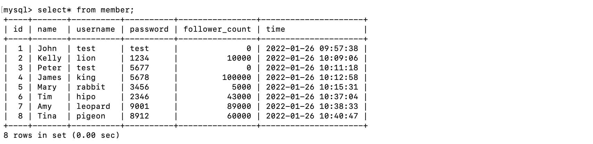
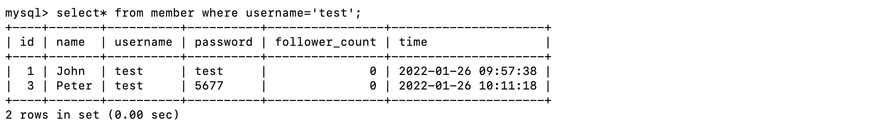
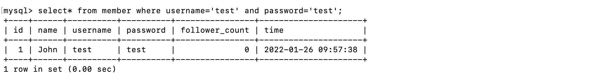

|  題目  | 實作  |
|  ---- | ---- |
| 要求三 - 1 |  |
| 要求三 - 2 |  |
| 要求三 - 3 |  |
| 要求三 - 4 |  |
| 要求三 - 5 |  |
| 要求三 - 6 |  |
| 要求三 - 7 |  |
|  |  |
| 要求四 - 1 |  |
| 要求四 - 2 |  |
| 要求四 - 3 |  |
|  |  |
| 要求五 - 1 |  |
| 要求五 - 2 |  |
